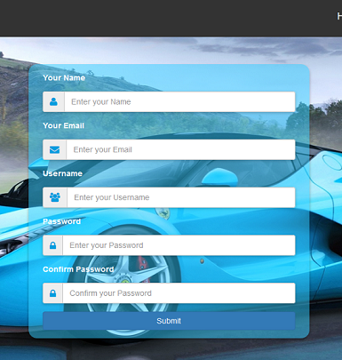
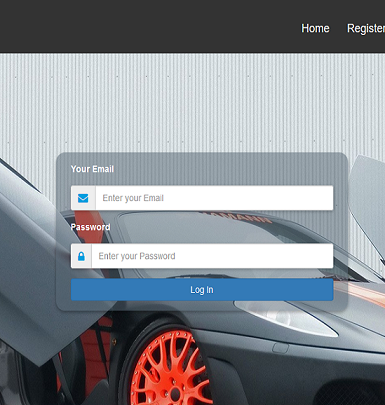

# Car Market

Car Market is an E-Commerce web application where users can visit, see and buy beautiful cars. This application is created to implement shopping cart. It is a [MEAN stack](https://en.wikipedia.org/wiki/MEAN_(software_bundle)) application.

## Technologies
  1. Frontend: **Angular**
  2. Runtime Environment: **Node.js**
  3. Backend Framework: **Express.js**
  4. Database: **MongoDB**
  
**Other technologies and tools**
  1. Frontend Scaffolding: **Angular CLI**
  2. Style and Layout: **Bootstrap**
  3. Login and Authentication: **Angular 2 JWT**
  4. Showing Messages: **Angular 2 Flash Messages**
  5. Admin and User Authentication: **JSON Web Token**
  6. Password Encryption: **Bcrypt.js**
  7. File Upload: **Multer**

## Installation
  1. Clone this repositry : `git clone https://github.com/Aktarul/Car-Market.git`
  2. Open a terminal in this directory
  3. Install dependencies : `npm install --save`
  4. Run server : `node server.js`
 
 Do not forget to start your database before running server.
  
**Open another terminal in the directory**

  5. Navigate to client directory : `cd client`
  6. Install dependencies : `npm install --save`
  7. Run client : `ng serve`
  8. Visit: `localhost:4200/home`

## Usage
After completing installation create at least one Admin. Here are the steps,
  1. Register an account. 
  2. Open any GUI for MongoDB ( Compass/ Robo3T )
  3. Change the created user's isAdmin property to true

Thus we will get an Admin. Now we can add, update, delete any product and also manage users from Admin account. Now register some users, add some products and visit home page.

## UI-Design with Angular

#### _Homepage_

#### _Cart_

#### _Admin Panel_

#### _Register and Login_
 . . . 

## Licence
This project is licensed under the MIT License - see the [LICENSE](LICENSE) file for details
