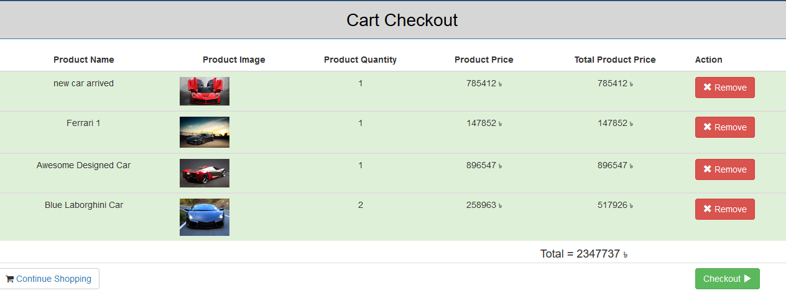

# Car Market

It is an academic project built for the implementation of shopping cart. It is a single shop platform where people can buy beautiful cars. JSON Web Token(JWT) is used for authentication. It is a [MEAN stack](https://en.wikipedia.org/wiki/MEAN_(software_bundle)) application.  Visit the web application [Live](https://infinite-sierra-61239.herokuapp.com).

## Technologies
  1. Frontend: **Angular**
  2. Runtime Environment: **Node.js**
  3. Backend Framework: **Express.js**
  4. Database: **MongoDB**
  
**Other technologies and tools**
  1. Frontend Scaffolding: **Angular CLI**
  2. Style and Layout: **Bootstrap**
  3. Login and Authentication: **Angular 2 JWT**
  4. Showing Messages: **Angular 2 Flash Messages**
  5. Admin and User Authentication: **JSON Web Token**
  6. Password Encryption: **Bcrypt.js**
  7. File Upload: **Multer**

## Installation
  1. Clone this repositry : `git clone https://github.com/Aktarul/Car-Market.git`
  2. Open a terminal in this directory
  3. Install dependencies : `npm install --save`
  4. Run server : `node server.js`
  5. Visit: `localhost:8080`
 
  That's it! Explore the application. Admin can add, update, delete any product and also manage users. Register as user visit home page   see the differences.
  
**To run client-side(angular project) manually open another terminal in the directory**

  1. Navigate to client directory : `cd client`
  2. Install dependencies : `npm install --save`
  3. Change every route of angular project to `http://localhost:`_8080-or-your-database-port-no_`/`_route_
  4. Run client : `ng serve`
  5. Visit: `localhost:4200/home`

## UI-Design with Angular

#### _Homepage_

#### _Cart_

#### _Admin Panel_

#### _Register and Login_
 . . . 

## Licence
This project is licensed under the MIT License - see the [LICENSE](LICENSE) file for details
